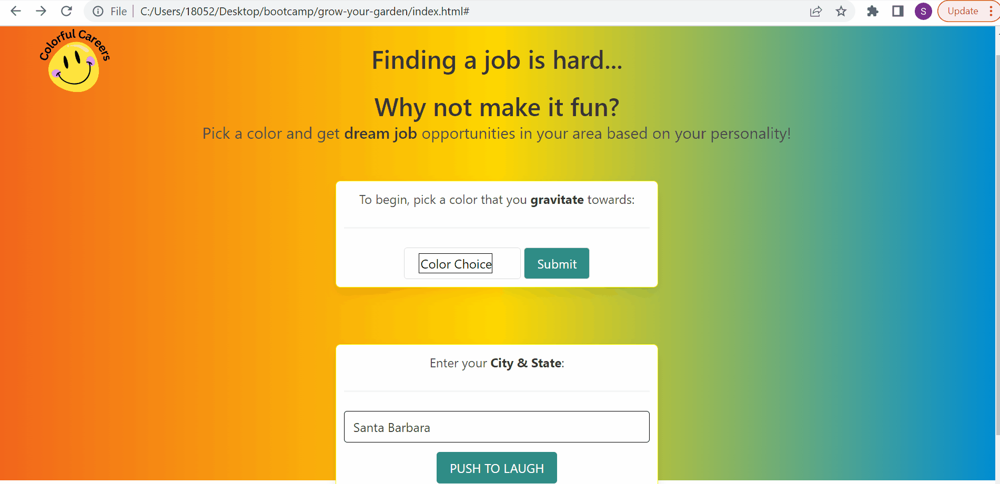
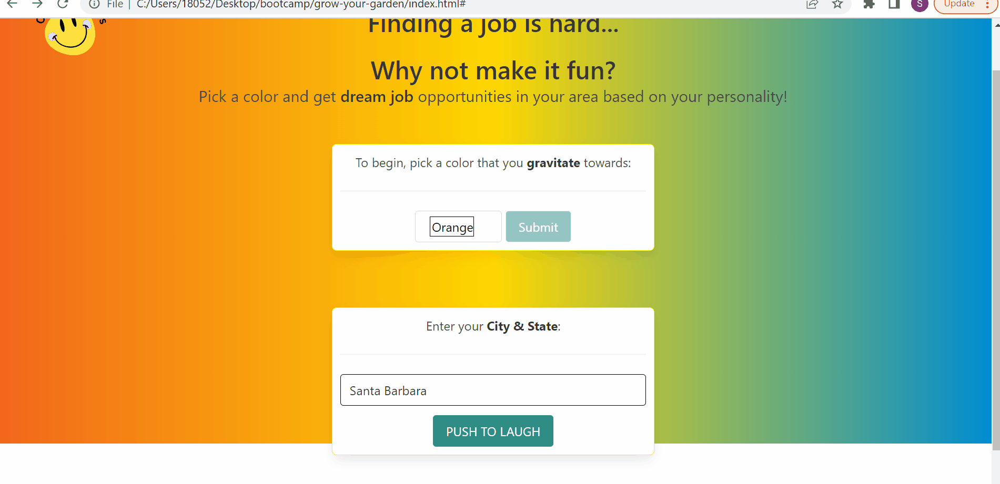

# Colorful Careers
Web application to help users find jobs in their area based on color psychology  

## Technology Used 

| Technology Used         | Resource URL           | 
| ------------- |:-------------:| 
| HTML    | [https://developer.mozilla.org/en-US/docs/Web/HTML](https://developer.mozilla.org/en-US/docs/Web/HTML) | 
| CSS     | [https://developer.mozilla.org/en-US/docs/Web/CSS](https://developer.mozilla.org/en-US/docs/Web/CSS)      |   
| Git | [https://git-scm.com/](https://git-scm.com/)     |    
| JavaScript | [https://developer.mozilla.org/en-US/docs/Web/JavaScript](https://developer.mozilla.org/en-US/docs/Web/JavaScript)     |  
| Bulma | [https://bulma.io/documentation/](https://bulma.io/documentation/)     |  
| Anime.js | [https://animejs.com/documentation/](https://animejs.com/documentation/)     |  
| Jsearch API | [https://rapidapi.com/letscrape-6bRBa3QguO5/api/jsearch](https://rapidapi.com/letscrape-6bRBa3QguO5/api/jsearch)     |  
| Daddy Jokes API | [https://rapidapi.com/Bmbus/api/daddyjokes/](https://rapidapi.com/Bmbus/api/daddyjokes/)     | 
| Canva | [https://www.canva.com/](https://www.canva.com/)     |  

## Description 

[Visit Colorful Careers](https://lauriefish22.github.io/Colorful-Careers/)

Colorful Careers uses aspects of color psychology testing to match users with career options and job openings in their area.

Deciding on a career can be one of the most stressful things in your life.   Whether it changing careers, just starting out or going back to school there is almost always doubt that you are making the right choice.  We are here to help!  What better way to choose your career than to let our app do it for you? 

After you choose a color from the dropdown menu and enter in your location, you will be shown which career path you should pursue and be able to see what jobs in that field are available in your area.  Excited?  Wait. There is more!  

We want to take even more stress away from you and make you laugh a bit.  After you submit your information you will be able to have a chuckle at a joke 😂


## Table of Contents 

* [User Stories](#user-stories)
* [API Deep Dive](#api-deep-dive)
* [Usage](#usage)
* [Learning Points](#learning-points)
* [Author Info](#author-info)
* [Credits](#credits)
* [License](#license)

## User Stories
All of our user stories along with two gifts that represent all the user stories 

* I want to be able to choose a color that I gravitate towards from a list
* I want to be able to input my current city so that I am only shown jobs in my area


* I want to be taken to page that lists available jobs when I l submit my color and location
* I want to see a joke when that page loads

* I want to only see jobs that match my color choice and location
* I want to be shown a maximum of ten jobs in my area 
* I want each job card to include the employer, job title, hours and a link to apply


## API Deep Dive

Using fetch to request data from the Jsearch API 

Creating a function to set a value to the variable job that will be used in our query.  Getting our user inputs that will be used for our query from local storage.
```JS
function getJob() {
    var job;
    var userColor = localStorage.getItem("chosenColor")
    if (userColor === "Gold") {
        job = "Lawyer"
    }
    if (userColor === "Orange") {
        job = "Journalist"
    }
    if (userColor === "Green") {
        job = "Web developer"
    }
    if (userColor === "Blue") {
        job = "Mediator"
    }
    var city = localStorage.getItem("citystate")
```
Our fetch request which returned us a JSON object that we used to render job specific information onto our page
```
 var search = job + " " + city
    // fetch request to jsearch api with search variable and page parameters
    fetch('https://jsearch.p.rapidapi.com/search?query=' + search + '&page=1&num_pages=1',
        {
            method: 'GET',
            headers: {
                'X-RapidAPI-Key': '2a85d5b83amsh63ca45e7faf958fp1fa3e8jsnb8946c519ebe',
                'X-RapidAPI-Host': 'jsearch.p.rapidapi.com'
            }
        })
        .then(function(response){
            return response.json()
        })
         
        .then(function (data) {
            console.log(data)

           
```


We also experienced new libraries for CSS and JS.  Bulma was used for styling and Anime for JS.  Below are examples of both.


**ANIME**

Using anime.js to add animation to a button

Below is a code snippet and an example of the working element.  Anime is a great tool that is used with JavaScript to create animation on an app.

```anime({
    targets: '.button',
    translateY: [
        { value: 300, duration: 800 },
        { value: 0, duration: 800 }
    ],
    rotate: {
        value: '1turn',
        easing: 'easeInOutSine'
    }
});
```



## Joke API

For the Joke, we used Daddy Jokes API from RapidAPI.  The information from the API is shown below.

```joke: "I don’t get why Marvel doesn’t use the Hulk to advertise more. He’s basically one big Banner. "
success: true
[[Prototype]]: Object
script2.js:35
I don’t get why Marvel doesn’t use the Hulk to advertise more. He’s basically one big Banner.
```

## User Story:  I want to see a joke pop up


```
**BULMA**

Using Bulmas prebuilt elements to create a dropdown menu
```<div class="dropdown is-hoverable">
                <div class="dropdown-trigger">
                    <button class="button2" aria-haspopup="true" aria-controls="dropdown-menu">
                        <span id="colorchoice">Color Choice</span>
                        <span class="icon is-small">
                            <i class="fas fa-angle-down" aria-hidden="true"></i>
                        </span>
```

## Usage 

Finds job openings based on users location and color choice.  


## Learning Points 

It was great for all of us to explore different libraries.  It can be easy to get used to only one "way" but you never know what you are missing out on if you don't experience other libraries and opportunities to either improve your project or make it easier to build.  It was also great practice in using API's and finding out (the hard way) that you may need to go through multiple API's to find the one that works for your project.  More than anything, it was our first experience in working with a group and not only practicing using github and different branches but about communication and helping each other out when needed. 

* New js libraries
* Collaborative Git workflow
* Server side apis
* Bulma 
* Anime.js 


## Author Info


###  Kakazi Kitenge


###  Shea Schwennicke


* [Portfolio](https://sheaschwenn.github.io/Portfolio/)
* [LinkedIn](https://www.linkedin.com/in/shea-schwennicke-76a378210/)
* [Github](https://github.com/sheaschwenn)

###  Laurie Fish


* [Github](https://github.com/lauriefish22)


## Credits

We gathered information from [indeed](https://www.indeed.com/career-advice/finding-a-job/color-psychology-test) for our color descriptions and job-color assignments. 


## License
MIT License

For more information please refer to the LICENSE in the repo.

---

© 2023 edX Boot Camps LLC. Confidential and Proprietary. All Rights Reserved.